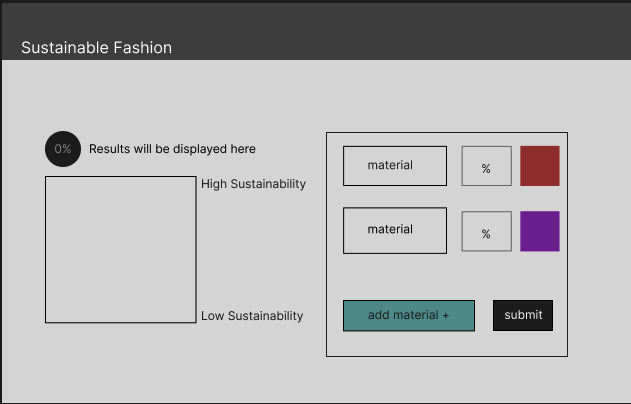
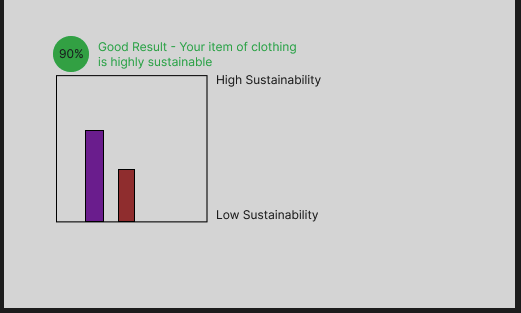

# sustainable-fashion
Simply analyze the material of your product to determine what it rates on sustainability

## Wireframes

Main page includes:
- a display for the sustainability rating of the clothes
- a form to fill out with the percentage of material used (default is equal percentage of all items if percentage is not included)
- materials will be a dropdown with options of materials used -- will keep track if user provided similar materials selection, limit number of materials for demo purposes 
- ability to hover over the materials to get more information on the materials user has entered

**wireframe of user interface**

**results visualization**
 

## Technologies

The app uses the following technologies:
- tailwindcss
- d3.js
- nextjs
- react
- typescript
- nodejs server